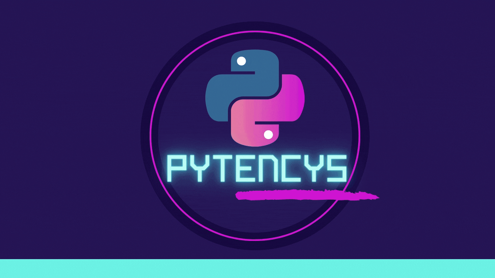

# PYTENCYS

## Eduardo Giopatto, Gabriel Tomé, Luis Guilherme, Tábata Santos

### Universidade de São Paulo, Escola de Engenharia de Lorena, departamento de Engenharia Física

  PYTENCYS foi criado com o intuito de mostrar como os autovalores e autovetores de maior módulo podem ser 
utilizados no nosso dia-a-dia, em mecanismos de busca (Google), sem que ao menos nós percebamos. 

  O projeto usa o algoritimo chamado método das potências, que se limita em achar apenas os autovalores e autovetores de                                           maior módulo, se limitando apenas a matrizes quadradas e diagonálisaveis.
  

